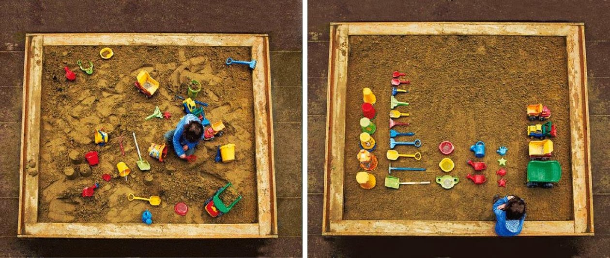

This article was originally published in Spanda Journal on 2015, on Systemic change:
https://www.academia.edu/13892001/Spanda_Journal_VI_1_-_Systemic_Change

# Permaculture Patterning, a design framework for systemic transformation

## From a mechanistic to a systemic view of the world

Since the times of Descartes, our world vision has been shaped by mechanistic mental models where every part of the universe is thought to work like a machine. Given enough time and resources we can crack/solve/tackle any problem. Or so was the vision.

The old model used to focus on identifiable parts, understand them by isolating them and breaking them down. These mechanistic mental models have been great tools and led to a lot of technological progress.

However the same models and techniques that produced progress are now threatening to destroy us. Blinded by the success of this reductionist approach we forget that the map is not the territory and that if approximations are helpful on a small scale, they can have disastrous effects on a large scale.

We are in a paradox where science has given us an incredible understanding of the world and powerful technological tools, yet the planet is on the verge of implosion with ecological, social, economical crisis looming. While the vast majority of people might agree on the problems and want change, we are stuck in a web of wicked problems, all interconnected and interrelated [^9].

Individually clever, we remain collectively stupid.

For the last century we have seen the emergence of a new paradigm[^7] that sees the world as a system, an interconnected set of elements that is coherently organized in a way that achieves a purpose[^15]. Although this new way of thinking has been there for decades, it is still relatively in its infancy.

Buffers, stocks, flows, feedback loops reinforcing or buffering actions: exploring and defining new systems concepts, Donella Meadows and others have helped us understand better the way systems function and given us a map of leverage points to act upon them[^14].

However, due to the inherent complexity of systems, it is still difficult to know where to start acting on a system to trigger effective change.

## Systemic change requires practical methods to change systems

Systemic change is challenging as it requires change to occur at multiple levels and in multiple disciplines.

Interestingly, in the late seventies, Australian ecological scientist Bill Mollison conceived permaculture, a design framework to change and optimize whole ecosystems. Central to Mollison's approach is the concept of patterning.

Patterning can be seen as a branch of design that focuses on relationships between elements rather than on elements themselves.

Mollison's notion of patterning seems to have been at least partially influenced by another systems thinker, Austrian born American architect Christopher Alexander.

Alexander developed a whole new way of thinking about architecture. Although it never became widespread in the field of architecture, it has revolutionized the way software developers think about software development and led to breakthroughs such as the wiki, a kind of software that makes a whole new way of working cooperatively possible, leading to the emergence of projects like Wikipedia.

These two design frameworks deal with whole systems transformation (ecological and architectural systems respectively) and have successfully applied systems thinking theories to material systems with visible and practical results.  It is therefore particularly interesting to study the methods they have developed to change systems. By doing so, we could isolate common principles that could be applied to other systems including less visible ones such as social and cultural systems.

In fact because systems are always linked to other systems, it is worth mentioning that permaculture and pattern languages already work with social and cultural forces in their design strategies.

It would be illusory to imagine we can summarize the vast complexity and richness of these two disciplines in such a short article so I will try to give the reader an overview of both approaches and to highlight key points.

We will start by examining Bill Mollison's Permaculture design framework, then explore Christopher Alexander's Pattern Language and then examine/identify the commonalities between these two approaches in order to see how they could be used in other contexts of systems design.

The aim is not so much to be exhaustive but rather to promote the reader's interest in these disciplines and spur the development of research on the topic of systems design and systemic change methodologies.

## Permaculture design framework

### Origin of permaculture

Permaculture was introduced formally by Australian Bill Mollison and David Holmgren after the publication of their book Permaculture One[^17] in 1978.

To date, the main body of knowledge for permaculture design remains the Permaculture Designer's Manual[^18] written by Bill Mollison in 1988. In this book Mollison defines Permaculture as

_"the conscious design and maintenance of agriculturally productive ecosystems which have the diversity, stability, and resilience of natural ecosystems (...) the harmonious integration of landscape and people providing their food, energy, shelter, and other material and non-material needs in a sustainable way."_[^18]
.

If the meaning of permaculture was originally restricted to "permanent-agriculture" it has now expanded to "permanent-culture" to encompass other aspects of culture (architectural, social, economical,...) that impact the design of agricultural systems.

_"_Permaculture design is a system of assembling conceptual, material, and strategic components in a pattern which functions to benefit life in all its form_"_[^18].

Although for most people permaculture is, at best, a clever way of gardening and various groups may have simplified it or at times added their own beliefs to it (stirring debate within the permaculture community[^13], at its core permaculture has a deep understanding of how ecosystem work and is firmly rooted in science.

### Permaculture design process

Before using any design principles or techniques, the core idea of permaculture is to start with a an ethical statement summarized as three principles that can be universally understood in any culture: Care For The Earth, Care For The People, Fairshare also called Return Of Surplus.

Permaculture sees this statement not just as a "feel good" idea but as an essential necessity. Indeed, there cannot be any sustainability if we don't care about the natural environment that supports us, and we can't expect to thrive and be in peace if people around us are struggling. The third principle encourages us not to just simply extract as much as we can but to redistribute a part of what we harvest in order to support the first two principles.

Permaculture therefore is an applied-science guided by ethics serving as a dynamic guideline for the permaculture designer throughout his choices.

The overall process of permaculture consist in getting an inner understanding of the characteristics and behaviors of the system before introducing gradual changes to create new links between elements in order to integrate these elements harmoniously so that they support each other.

This starts by assessing the site and its surroundings, using direct observation, and collecting climatological, topological, geological, biological, legal, social and cultural data.

The next step is to map the various forces, buffer/stocks, flows, elements and their properties in detail to get a complete overview and understanding of the system.

Based on this inner understanding of the system, design is conceived over space and time. Guided by a set of thoughtful principles the designer introduces connections, always taking into account the evolution of the system and the unpredictability of all associated events.

### Permaculture principles

Mollison established the first core principles[^18]. More recently, permaculture's co-founder David Holmgren adapted Mollison systemic/complex vocabulary in an everyday language easier to understand and tried to summarize permaculture design under twelve principles[^12].

However all principles still fall in the philosophy described by Mollison:

"The philosophy behind permaculture is one of working with, rather than against, nature; of protracted and thoughtful observation rather than protracted thoughtless action; of looking at systems in all their functions, rather than asking only one yield of them; and of allowing systems to demonstrate their own evolutions."[^18]

To be resilient like a forest, permaculture systems are designed so that _each important function is backed up by several elements_, and_each element performs several functions_. This can be achieved by _relative location_ principle where every element is placed in relationship to another so that they assist each other.

Permaculture maximizes _harvest of energy_ and _recycling_ within the system to create stocks and buffers while trying to _make the least change for greatest possible effect_. This is done by _efficient energy planning, use of biological resources_and building_small-scale intensive systems_.

Permaculture also has _Attitudinal Principles_. Firmly rooted in a positive attitude, permaculture thinks any problem is an opportunity and everything can be seen as a positive resource. How we use it to make it advantageous is up to us (_the problem is the solution_). For example if the wind blows cold, we can use both its strength and its coolness to our advantage (for example, funneling wind to a wind generator, or directing cold winter wind to a cool cupboard in a heated house).

By weaving such productive relationships step by step, permaculture creates a dense network of harmonious connections. This "creative order" leads to a productive flow of energy cycling and a thriving system.

### Patterning concept in permaculture

The whole permaculture designer's manual and the associated permaculture design course is very practical, dealing with topics such as climatology, soil science, plant and animal biology, architecture, legal structures.

It is noteworthy that one entire chapter deals with the notion of patterns, investigating the commonalities between various natural patterns and teaching the designer how he can use these to get insights about the inner working of systems and use them to his advantage. Mollison also discussed tribal use of patterns as a way to encode knowledge about systems.

Patterning is very important for Mollison who sees it as a kind of multidimensional design that goes beyond other design approaches:

"Patterning is the way we frame our designs, the template into which we fit the information, entities, and objects assembled from observation, map overlays, the analytic divination of connections, and the selection of specific material and technologies. It it this patterning that permits our elements to flow and function in beneficial relationships. The pattern IS design, and design is the subject of permaculture."

## Pattern Languages design framework

### Origin of pattern languages

At about the same time as Mollison and Holmgren were setting the foundations of a method for ecosystems design, Austrian born American architect Christopher Alexander released A Pattern language[^1], and The Timeless Way of Building[^2], two books exposing a new theory for architectural design.

In these twin books, Alexander presented a radically new approach to building complex architectural systems. Starting from the fact that traditional buildings throughout the world had a special quality that was lacking from most modern and post-modern architectures, he went to identify best practices for architectural design.

Alexander recognized that piling up good design ideas was not enough to build a good structure, and that the context was of uttermost importance. When dealing with a complex system with potentially thousands of variables influencing each other and where each choice impacts the next, how do we make sure we get it right ? How did the traditional cultures - where most often people were not formally trained in architecture - manage to build structures that lasted for centuries and still amaze us ?

Alexander hypothesized that throughout the world, builders used certain "languages" that, although implicit, were directly transmitted and helped them design and build good structures.

He argued that the 20th century lost this knowledge, and devised the pattern language method as a way to make this knowledge explicit and revive it. Christopher Alexander coined the term _Pattern Language_ to refer to a collection of common problems pertaining to the design and construction of buildings and towns and how they should be solved.

### The concept of Patterns and Pattern Languages

In everyday use a pattern describes a plan, diagram, or model to be followed in making things, for example, _a dress pattern_[^24]_._ In nature, patternsare visible regularities of form found in the natural world[^26].

In systems thinking, the notion of pattern is very important[^7]. Early systems thinker Ross Harrison defined the concept of _pattern as a configuration of ordered relationships_ (cited by Capra[^7])

Studying what made a good architectural design, Alexander used the concept of pattern and extended it[^25].

In Alexander's view a pattern is "a careful description of a perennial solution to a recurring problem within a building context, describing one of the configurations that brings life to a building"_._

The core of Alexander's approach is to identify and document the key ideas that make a good system different from a poor system so they can be used to assist in the design of future systems.

In Alexander's theory, " Each pattern describes a problem that occurs over and over again in our environment, and then describes the core solution to that problem, in such a way that you can use the solution a million times over, without ever doing it the same way twice."

Patterns help us remember insights and knowledge about design and can be used in combination to create solutions.

One might say that every pattern which was defined under that theory was, in effect, a rule for making or partly making some important type of center (ie, sub-system), necessary to the life of a living human environment.

Typically, these solutions are documented as a _problem-context-solution_ three-parts rule (this format was later called "design pattern" by his followers)

The solution expressed in a pattern should be _general enough_ to be applied in very different systems, but still _specific enough_ to give constructive guidance. An important part in each pattern is to _describe the context_, ie the range of situations in which the problems and solutions addressed in a pattern apply.

The patterns, because of their explicitness, allow discussion, debate, and gradual improvement of the material.

[http://www.lilianricaud.com/travail-en-reseau/wp-content/uploads/2015/05/sufi-story.jpg](http://www.lilianricaud.com/travail-en-reseau/wp-content/uploads/2015/05/sufi-story.jpg)

In _A Pattern Language,_ Alexander and colleagues listed 253 "patterns" varying in their level of scale and including suggestions ranging from how cities and towns should be structured to where windows should be placed in a room.

Taken together this collection of patterns form a common language that help to make knowledge explicit and shareable within a field of expertise.

A pattern language gives each person who uses it the power to create an infinite variety of new and unique structures, just as ordinary language gives him/her the power to create an infinite variety of sentences.

A person with a pattern language can design any part of the environment and does not need to be an expert because the expertise lies in the language.

### Patterns: More than meet the eyes

Although it hasn't gained much traction in architecture, the pattern language approach has been used to document expertise in diverse fields such as computer science, human computer interaction, education, and group facilitation [^11],[^23],[^27],[^28],
. In computer science particularly, it sparked a revolution in thinking and led to a new way of writing computer code[^16].

However pattern languages are mostly seen as a formal way of documenting a solution to a common design problem and few seem to understand and use them in a systems thinking perspective.

Alexander warned that patterns are more than just clever design tools or formats. As we shall see the notion of pattern is both simple and elusive.

 A pattern is at the same time:

- a field—not something fixed, but a bundle of relationships, capable of being different each time it occurs, yet deep enough to bestow life wherever it occurs.
- a three-part rule, which expresses a relation between a certain context, a problem, and a solution.
- as an element in the world, it is a relationship between a certain context, a certain system of forces which occurs repeatedly in that context, and a certain spatial configuration which allows these forces to resolve themselves.
- as an element of language, a pattern is an instruction, which shows how this spatial configuration can be used, over and over again, to resolve the given system of forces, wherever the context makes it relevant.

The pattern is, in short, at the same time a thing, which happens in the world, and the rule which tells us how to create that thing, and when we must create it. It is both a process and a thing; both a description of a thing which is alive, and a description of the process which will generate that thing[^3],[^4].

It is important to insist that, more than just being a way to describe a good practice, a pattern is a particular _configuration_ - within a particular system - that integrates and resolves a set of conflicting forces in a harmonious/non-forceful manner.

This forces can be structural, social, psychological, psychic, natural or a mix of several different ones[^2].

The power of good patterns comes from the fact that when the _qualitative relationship_ between elements is right, it allows the various forces in presence to be used productively by the system to maintain itself and/or help maintain the sub-systems it contains and the wider systems it is part of.

This is in essence what Alexander calls "life" and possesses what he used to call "the quality without a name".

When a system contains lots of "living" (creative or generative) patterns, self-regulation increases, entropy/disorder decreases and the system becomes more complex while remaining coherent as a whole.

When a system has too little "living" patterns or too many dead (destructive) ones, self-regulation decreases, entropy/disorder increases and eventually leads to a system collapse.

### From pattern languages to generative sequences

In his latest work, Alexander refined the theoretical framework behind pattern languages and explained the underlying basis for pattern language efficiency.

In the Nature of Order[^1],[^2] he proposes a deep and fascinating theory postulating that what he calls "centers" (the various "parts" or "elements" of a system described by patterns) emerge from the whole via a step-by-step unfolding process that preserves, differentiates and extends the existing structure by the application of fifteen possible transformations.

One of the point he makes is that his first pattern language lacked instructions on the order in which to use the patterns to get this unfolding process correct. He now focusses on what he calls generative sequences, ordered sequences promoting a generative process.

Embryonic development is an example of a natural generative process. In an embryonic cell, the DNA doesn't contain a full description of the organism to which it will give rise. Instead, The genome contains a program of instructions for making the organism.

Similarly we can use artificial generative processes to build complex structures. To describe in any detail the final form of an Origami and the complex relationships between its parts is very difficult and not of much help in explaining how to achieve it. Much more useful and easier to formulate are instructions on how to fold the paper.

A generative sequence is a set of instructions that when used in the right order, allows a complex structure to emerge effortlessly and may be thought of as a second generation pattern language[^6].

## Common ideas/principles between the pattern language and permaculture frameworks

### Start with an Ethical framework

It is relevant to note that in Donella Meadows leverage points, the mindset or paradigm  that the system arises from is ranked as one of the highest leverage points.

We currently operate from a paradigm where the natural world and people are seen just as commodities that can be controlled and manipulated to extract profits.

If we are to change the system we need a new paradigm with different visions and values, based on strong ethics.

Ethics, embedded throughout Alexander's writing,  are even more central in permaculture, where they come before any technique or method. Permaculture ethics are very practical, summarized as three principles that can be universally understood in any culture.

Starting with an ethical statement such as the one used by permaculture is a simple yet extremely important point for positive systemic change.

### Map what is already there and work creatively with it to preserve and extend it

Permaculture starts early on by mapping all the various elements and forces and tries to build upon what already exists by making the smallest change with the most powerful effect. Alexander usually works by building pattern languages that preserve and extend the existing systems. In his approach structure-preserving transformation is seen as a fundamental principle of uttermost importance.

In each method,  having a deep understanding of the context before taking any action is seen as essential. Valuing what exists and working creatively with it to make it more whole is seen as the right way to go, whereas arbitrarily wiping out the existing to build something new is seen as wrong and counterproductive at best and extremely damaging at worst. It should be only done on a limited scale and in particular cases.

### Shift focus from objects to relationships

Fritjof Capra clearly highlighted the differences between the mechanistic and systems world views[^7].

In the traditional mechanistic approach, the world is seen as a collection of objects or elements. These of course interact with one another and hence there are relationships between them, but relationships are seen as secondary. In the systems view, relationships are seen as primary. As Capra wrote:

_"In the systems view, we realize that the objects are networks of relationships, embedded in larger networks. For the systems thinker the relationships are primary. The boundaries of the discernible (patterns) objects are secondary. Ultimately - as quantum physics showed us so dramatically - there are no parts at all. What we call a part is merely a pattern in an inseparable web of relationships"._

Alexander proposed the term of "centers" to describe these networks of relationships or elementary parts of a system.

Strongly anchored in systems thinking, permaculture and pattern language, at their core, are about building productive relationships between these centers so that they support each other.

### Create new links between centers so that they support each other.

Creating new links between elements to harmoniously integrate elements so that they support each other is at the core of permaculture design. Gradually weaving beneficial relationships, permaculture creates a dense network of harmonious connections leading to a productive and resilient system.

Pattern language, at its core, is also about building beneficial configurations of relationships at every scale of a system and its sub-systems. In his more recent work Alexander went further and described fifteen fundamental transformations that can be used to make links between centers more powerful. Patterns get their properties because they induce one or several of these fifteen transformations. So not only do we have to create links, the _qualitative_ nature of the link is also essential.

### Shift from a descriptive to a generative approach

Traditional design focuses on describing what should be, which elements should be there and how they are linked. After this labor intensive phase, the design is then produced: parts are built and assembled to fit the description previously made.

In contrast both permaculture and pattern language take a generative approach, i.e. following a sequence of instructions that will shape the evolution of the system.

A descriptive program, like a blueprint or a plan, describes an object in some detail, whereas a generative program describes how to make an object. For the same object, these two programs are very different.

As we've seen before both origami and embryonic development contain a generative program for making a particular structure and it would be almost impossible to create these structures without a generative sequence.

### Work by step-by-step adaptation using feedback at each step

Dealing with natural cycles, permaculture has to work by steps _de facto_. Interestingly permaculture tries to accelerate these natural cycles, effectively increasing time density.

Alexander stresses the importance of working gradually step-by-step, strongly insisting that each part of the environment, at every stage of its planning, conception, and construction, must be developed and evolve step-by-step, each step being an adaptation through which things get fitted more and more closely to a harmonious whole.

To guide the adaptation, at each step in the process there must be a continuous and relatively immediate feedback about whether what has been done is a living structure in sufficient degree.

Developing such generative sequences as proposed by Alexander seems an essential tool to structure this step-by-step process.

### Design mainframe first, then go into details

Systems are intrinsically highly complex structures and knowing where to start can be extremely hard to figure out.

Within the awareness of the whole, both approaches try to get started by focussing on major aspect first - the overall pattern - before refinement. Identifying these "Major aspects" is both an art and a science and both frameworks have their own methods, using deep logical analysis as well as deep intuitive feeling of the system.

In permaculture this is called working from patterns to details, whereas Alexander tries to identify major patterns/centers and then strengthen them in the process.

One guideline to identify the major aspects to work on first could be this recommendation from Alexander: _"At each step, direct your attention to centers, the unit of energy within the whole, and ask: which one center could be created (or extended or intensified or even pruned) that will most increase the life of the whole"_.

### Always be aware of the Whole(s)

Systems properties are properties of the whole which none of the parts have. These properties arise from the 'organizing relations' of the parts, i.e. from a configuration of ordered relationships characteristic of that particular class of organisms. Systems and these systemic properties are destroyed when a system is dissected into isolated elements. Shifting our focus from parts to whole is therefore a core idea of systems thinking[^7].

While in a mechanical process, parts are formed independently of the whole, and then added together to form an aggregation, in a living structure, the parts come into being within the whole, emerging and getting differentiated from it[^1][^2].

Having a holistic perspective and remaining aware of the whole at each step of the design process is therefore essential for systems design, and both pattern languages and permaculture strongly pay attention to this.

Moreover we need to keep in mind that, because systems are always nested within systems, each sub-system is a whole in itself yet constantly influencing the other scales. Because of this fractal nature of systems we need to be able to shift focus between small and big scale to really grasp the whole.

### Change your view of order: Accept unpredictability &amp; emergence

From the systems thinking perspective, the "neat" or "tidy" machine-like order we are used to in the mechanistic view is actually an artificially maintained disorder which is energetically very costly and very inefficient compared to the "messy" but vastly more complex natural order of living systems.

 
extract from Ursus Wehrli: The Art of Clean Up: Life Made Neat and Tidy[^29]

[http://www.lilianricaud.com/travail-en-reseau/wp-content/uploads/2015/05/ursus-wehrli-playground.jpg](http://www.lilianricaud.com/travail-en-reseau/wp-content/uploads/2015/05/ursus-wehrli-playground.jpg)

Systems by virtue of their structure have inherent tendencies to evolve and behave a certain way. Instead of pushing a system into what permaculture calls "forced function" by trying to control it, it is far more efficient to let the system evolve towards its own direction and work creatively with it and not against it.

This implies we understand the latent potential which is already present, and work not to "make" something but to help it emerge.

Accepting a part of unpredictability can be hard for mechanistic thinkers but an essential part of system design.

This doesn't mean we cannot have an influence on where the system is going. Because we are also part of the system, we can have an influence. But we should accept willfully that although we can set the direction, we cannot predict and control entirely the way to get there.

### Shift your focus from quantitative to qualitative assessment

As Capra argues, for most of the time the study of patterns was eclipsed by the study of substance until it re-emerged forcefully in our century, when it was recognized by systems thinkers as essential to the understanding of life. In the study of substance, we measure and weigh things. Patterns, however, cannot be measured or weighed; they must be mapped. To understand a pattern, we must map a configuration of relationships. In other words, substance involves quantities, while patterns involves qualities.

The study of patterns is crucial to the understanding of living systems because systemic properties, as we have seen, arise from a configuration of ordered relationships. Systemic properties are properties of a pattern. What is destroyed when a living organism is dissected is its pattern. The components are still there, but the configuration of relationships between them - the pattern - is destroyed, and thus the organism dies.

If we fail to understand the importance of the qualitative and focus only on what can be quantified we are doomed to fail at designing systems. As Einstein has been quoted to say: "_Not everything that can be counted counts, and not everything that counts can be counted_".

Both permaculture and pattern language approaches understand this and so should a system designer.

### Rely on your intuition and feeling as a tool to comprehend the wholeness of systems.

Implicit in Mollison's approach but explicit in Alexander's is that our rational mind is not sufficient to grasp the complexity of systems and we have to rely on our intuition and feeling as a tool to comprehend the wholeness of systems.

Alexander did experiments to prove there is an objective reality behind our feelings and that it is a better tool to embrace complexity than our logical rational mind overwhelmed by the number of variables in a complex system.

Alexander discussed this extensively in The Nature of Order, and it is the aspect of the intellectual paradigm he offers which is the most at odds - at least on the surface - with the Cartesian paradigm.

## Toward a new design method for systems

As mentioned earlier, systemic change requires structured design methods, just like engineers or designers have structured methods to build objects. However, designing systems is extremely challenging because of their very complex nature.

The design discipline, as we think about it today, is still strongly anchored in a mechanistic/reductionist view of the world, focussing on elements and parts. Worse sometimes design places appearance before function.

If we want systemic change for the better there is a danger of trying to solve systemic problems using a reductionist approach[^8],[^20]. The promise of quick technological fixes can be seductive, but as we discussed earlier this can have disastrous effect when dealing with large systems.

As Albert Einstein famously said – "We can't solve problems by using the same kind of thinking we used when we created them_._" Donella Meadows number one leverage point was the ability to transcend paradigm.

Can we imagine a design discipline that grows with its roots in the systems thinking paradigm ?

## From designing to patterning

Indeed, in the last few years  new schools of thought have emerged in the design field. Pioneered by developers seeking to improve their ability to deal with complex software building projects, agile methodologies embed in their process several principles common to pattern languages and permaculture approach: (iterative steps, structure-preserving unfolding, adaptive instead of predictive approach, use of feedback …).

Interestingly Ward Cunningham, inventor of the wiki and one of the main actors of the extreme programming methodology and the Agile Manifesto was directly influenced by Alexander[^21],.

Another school of thought, Design Thinking, also aims to tackle complex design problems with principles common to the ones we have seen (using the creative/intuitive mind to complement analytical thinking, focusing on process before form, etc…)

However if the use of these new methodologies has already showed great results, it seems the patterning methods developed by Alexander and Permaculture are more profound and could enhance the power of these design methods.

Beyond the surface, Permaculture design and Pattern Languages are more than just clever methods of design. They are entirely new ways of approaching design, not in a mechanistic view of the world but firmly rooted in the systems thinking paradigm.

Both anchored in reality (they deal with buildings and gardens and people, so they cannot afford to be only conceptual, they have to work practically) and strongly inspired by thousand-years old traditional cultures, these two approaches have developed a set of robust principles for systems design.

## Permaculture Patterning

As discussed throughout this article, central to both design frameworks studied is the concept of patterning. Although it is not clear how much Mollison was influenced by Alexander, both permaculture and pattern language use the notion of patterns with slightly different yet very complementary views.

Mollison explored particularly well the use of natural patterns and the tribal use of patterns while Alexander studied patterns in nature and human designed structures to propose a revolutionary theory of the world.

The notion of patterning is promising and it is important that further research is carried out.

As a start I would like to propose Permaculture Patterning as a new branch of design explicitly aimed to design thrivable systems. Permaculture patterning use Alexander generative pattern approach grounded in permaculture ethics and philosophy.

Here are some core principles of permaculture patterning I propose as a basis for future discussion:

- Start with an Ethical framework
- Map what is already there and work with creatively with it to preserve and extend it
- Shift focus from objects to relationships
- Create new links between centers so that they support each other.
- Shift from a descriptive to a generative approach
- Work by step-by-step adaptation using feedback at each step
- Design mainframe first, then go into details
- Always be aware of the Whole(s)
- Change your view of order: accept unpredictability &amp; emergence
- Shift your focus from quantitative to qualitative assessment
- Rely on your intuition and feeling as a tool to comprehend the wholeness of systems.

Some initiatives are already moving in this directions[^9] and I hope this article encourages the development of more systems thinking research and education and the democratization of this ideas in the wider society. We urgently have to update our obsolete cartesian worldview if we are to achieve systemic change for the better.

Although systems thinking and the proposed Permaculture patterning framework are complex topics, we should aim to make this knowledge accessible to everyone, and build more practical tools and methods to empower people to act on their environment harmoniously.

The cartesian paradigm helped us develop great technological capabilities and research helped us build comprehensive systems theories. However we should be cautious not to repeat the same mistakes of thinking that "we know and they don't". Before we try to superimpose new systems thinking solutions blindly onto people and natural systems, we should stay humble, have the humility to accept that, as Mollison and Alexander taught us, traditional cultures often inherently had profound system thinking views of the world and developed many efficient tools to work harmoniously with systems.

We don't need to race to reinvent solutions which are already there, but just keep our eyes open and gives ourselves time to be able to see them. Then we might be able to slowly weave them together one pattern at a time.

Left on their own, systems seem to evolve naturally towards greater stability. Recognizing we are only a small part in a dynamic web of systems, we should move forward, not as teachers/makers but as learners/enablers. Letting human and natural systems be our guides, maybe we can facilitate what is already waiting to emerge and let systemic change happen on its own.

CC-BY-SA Lilian Ricaud (2015)

## References

1. Alexander, C. Ishikawa, S. Silverstein, M. (1977) _A Pattern Language: Towns, Buildings, Construction_ (Oxford University Press)
2. Alexander, C. (1979) _The Timeless Way of Building_ (Oxford University Press)
3. Alexander, C. (2004) _The Phenomenon of Life: The Nature of Order, Book 1: An Essay of the Art of Building and the Nature of the Universe_ (Berkeley: The Center for Environmental Structure).
4. Alexander, C. (2004) _The Process of Creating Life: The Nature of Order, Book 2: An Essay of the Art of Building and the Nature of the Universe_ (Berkeley: The Center for Environmental Structure).
5. Alexander, C. et al. (2012) _The Battle for the Life and Beauty of the Earth: A Struggle between Two World-Systems_ (Oxford University Press)
6. Alexander, C. An Introduction to Generative Sequences [http://bit.ly/1AQTEDr](http://bit.ly/1AQTEDr) [retrieved 20 April 2015].
7. Capra, F. (1996) The Web of Life - A New Scientific Understanding of Living Systems (New York: Anchor Books)
8. Eisenstein, C. (2015) _We need regenerative farming, not geoengineering_ [http://bit.ly/1Iw3Xmv](http://bit.ly/1Iw3Xmv) [retrieved 20 April 2015].
9. Finidori, H (2014). "A pattern language for Systemic Transformation (plAST) - (re)generative of Commons" [http://bit.ly/11xd2of](http://bit.ly/11xd2of) [retrieved 20 April 2015].
10. Finidori, H. (2014). _An Ecology of Transformative Action Awaiting To Be Discovered_ (Spanda Journal, Vol. V, 1)
11. Group Works (2015) _Group facilitation patterns_ [http://bit.ly/1H9gomO](http://bit.ly/1H9gomO) [retrieved 20 April 2015].
12. Holmgren, D. _Permaculture principles_ [http://bit.ly/1vkwoLG](http://bit.ly/1vkwoLG) [retrieved 20 April 2015].
13. Mackintosh, C. (2011) _Permaculture and Metaphysics_ (The Permaculture Research Institute blog) [http://bit.ly/1H9gpHa](http://bit.ly/1H9gpHa) [retrieved 20 April 2015].
14. MEADOWS, D.H. (1997). "Leverage Points: Places to Intervene in a System" &lt; http://bit.ly/1rsFIdv &gt; [retrieved 25 April 2014].
15. Meadows, D.H. (2008) _Thinking in Systems: A Primer_ (Chelsea Green Publishing Company)
16. Mehaffy, M. and Salingaros N.A. (2011) _The Pattern Technology of Christopher Alexander_ [http://bit.ly/1ItiUY7](http://bit.ly/1ItiUY7)[retrieved 20 April 2015].
17. Mollison,  B. &amp; Homgren D. (1978) _Permaculture One_ (Tagari Publications)
18. Mollison,  B. (1988) _Permaculture: A Designers' Manual_ (Tagari Publications)
19. Mollison, B. &amp; Mia Slay, R. (1994) _Permaculture principles_ (Tagari Publications) listed in [http://bit.ly/1AQTRGA](http://bit.ly/1AQTRGA) [retrieved 20 April 2015].
20. Widows, R. (2015) _The Complexity of Reductionism: A Case Study of Genetic Engineering_ [http://bit.ly/1PBA2tD](http://bit.ly/1PBA2tD) [retrieved 20 April 2015].
21. Wikipedia (2015) _The Agile Manifesto_ [http://bit.ly/1GYCk1h](http://bit.ly/1GYCk1h) [retrieved 20 April 2015].
22. Wikipedia (2015) _Design Thinking_ [http://bit.ly/1zVsPDd](http://bit.ly/1zVsPDd) [retrieved 20 April 2015].
23. Wikipedia (2015) _Interaction Design Patterns_ [http://bit.ly/1H9gzhX](http://bit.ly/1H9gzhX) [retrieved 20 April 2015].
24. Wikipedia (2015) _Pattern (disambiguation)_ [http://bit.ly/1FZ9Zfh](http://bit.ly/1FZ9Zfh) [retrieved 20 April 2015].
25. Wikipedia (2015) _Pattern in Architecture_ [http://bit.ly/1KWLBuC](http://bit.ly/1KWLBuC) [retrieved 20 April 2015].
26. Wikipedia (2015) _Patterns in Nature_ [http://bit.ly/1zS6UfP](http://bit.ly/1zS6UfP) [retrieved 20 April 2015].
27. Wikipedia (2015) _Pedagogical Patterns_ [http://bit.ly/1QAJFuQ](http://bit.ly/1QAJFuQ) [retrieved 20 April 2015].
28. Wikipedia (2015) _Software Design Pattern_ [http://bit.ly/1GYCsxV](http://bit.ly/1GYCsxV) [retrieved 20 April 2015].
29. Wehrli, U. (2013) _The Art of Clean Up: Life Made Neat and Tidy_ (Chronicle Books)

